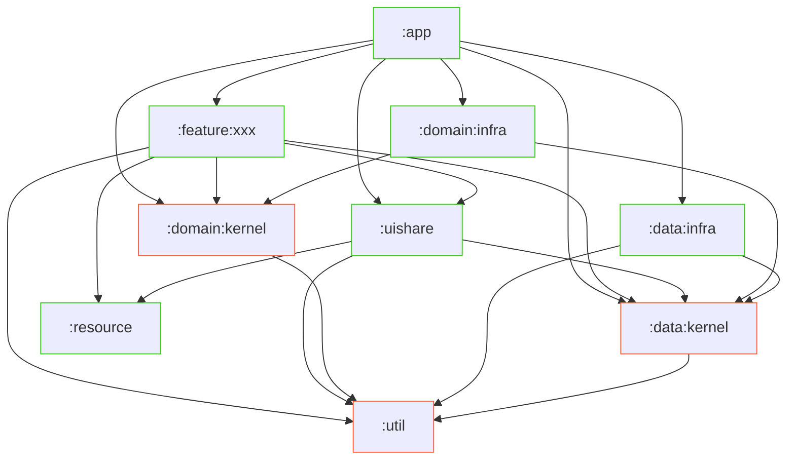

<h1 align="center">ZeroPoint</h1><br />

A demo app on Android to check Valorant stats.

The purpose of this repository is to demonstrate below:

- A mini app using new and practical libraries and architectures with 100% Compose.
- Exploring better navigation methods in Compose that do not use unofficial libraries.
- Use version catalogs and Gradle plugin-based build logic management (independent of buildSrc).
- Try to use unofficial-valorant-api.

# Tech and libraries

- Jetpack
  - [Compose](https://developer.android.com/jetpack/compose)
    - [Material 3](https://developer.android.com/jetpack/androidx/releases/compose-material3)
    - [Navigation Compose](https://developer.android.com/jetpack/compose/navigation)
  - [DataStore](https://developer.android.com/jetpack/androidx/releases/datastore)
  - [SplashScreen](https://developer.android.com/jetpack/androidx/releases/core#core-splashscreen-1.0.0)
  - ViewModel
- [Dagger Hilt](https://developer.android.com/training/dependency-injection/hilt-android)
- Design and architecture
  - multi-module
  - Clean Architecture
- KotlinX
  - Coroutines
  - Serialization
  - Datetime
- Testing
  - JUnit 5
  - kotest-assertion
  - mockk
- Ktor Client
- Coil

# Environment

Android Studio Flamingo 2022.2.1 Canary 9

# Design and architecture

## Modularization

Nodes with red outer borders mean modules that depend only on the JVM,
and nodes with green outer borders mean modules that depend on Android.

From a collocation standpoint, it is preferable that the implementation and abstract modules be under the same directory.

Modules such as `:data` and `:domain` have `:xxx:kernel` and `:xxx:infra` modules as children. These modules are just directories, and each child module is used according to DIP, with the `:xxx:kernel` module having the abstraction and `:xxx:infra` its implementation. Also, `:xxx:kernel` has its fake implementation.



- `:app`: An entry point for Android. It does not have any business logic here, just Application and MainActivity.

- `:uishare`: Common implementations between feature modules. This module contains UI-related implementations such as generic Composable, navigation, and themes. It also places utility logic that will be common in each feature module. Note that they are separate from `:util` and should not have domain logic.

- `:resource`: A module with resources. It has common drawables, strings, values, etc.

- `:data`: This module has a repository definition and implementation and domain model based on [the data layer](https://developer.android.com/topic/architecture#data-layer) recommended by Android. The repository implementation manages and provides data sources, including persistence, and caching.

- `:domain`: This module has usecases based on [the domain layer](https://developer.android.com/topic/architecture/domain-layer) recommended by Android. Note that this is a layer with usecases, unlike the domain model layer called by Clean Architecture and others. For simplicity, this module should only have business logic that is reused, and should not create use cases that mediate `:data` from the start.

- `:feature:xxx`: These are modules with actual UI based on the feature modules included in [the general pattern](https://developer.android.com/topic/modularization/patterns) for Android development. in ZeroPoint, modules are separated by navigation graph units.

## Robust error handling

To tell the caller that an error has occurred, Kotlin commonly expresses it as a value and returns it.
Kotlin employs unchecked exceptions, which can miss domain-specific errors that should be addressed.
The most commonly used exception is nullable, but that removes all context from the error and may not allow for proper handling of errors that do occur.
The same is true for `Result<T>` in the Kotlin standard library. As mentioned in [KEEP](https://github.com/Kotlin/KEEP/blob/master/proposals/stdlib/result.md#error-handling-style-and-exceptions), we do not want to use domain-specific errors in Result.

So here we use `Result<V, E>` from `kittinunf/Result`. However, since Result is a type that is used everywhere from the domain model layer to the infrastructure layer and can be implemented with a simple definition, we think it is acceptable to prepare it internally depending on the scale of the application.
Also, we don't want the name of the type to be the same as the standard Result in Kotlin, so we will use an alias like `typealias Either<L, R> = Result<R, L>`.

Now, let's consider the repositories that will actually return the most errors.
In many cases, the same repository will return similar errors. So when you define a repository, you define its interface and the sealed interface of the error.
Of course, if necessary, the error types may be separated by endpoint or by process.

However, we would like to make common errors that can occur even in multiple repositories (and since ZeroPoint is a small application, such will be the case in most cases). So such errors can be implemented independently and have them as per-repository error parameters.

# Set up

- `./gradlew addKtlintFormatGitPreCommitHook` (ktlint-gradle)

# Credit

- All Valorant image resources are copyrighted by Riot Games.
- [Line Drawer (cre8tiveAI)](https://ja.cre8tiveai.com/lid)
- [Valorant font](https://www.dafont.com/valorant.font)

# License

MIT license. But for code that has a separate license at the top of file, please follow it.

```
Copyright 2022 blackbracken

Permission is hereby granted, free of charge, to any person obtaining a copy of this software and associated documentation files (the "Software"), to deal in the Software without restriction, including without limitation the rights to use, copy, modify, merge, publish, distribute, sublicense, and/or sell copies of the Software, and to permit persons to whom the Software is furnished to do so, subject to the following conditions:

The above copyright notice and this permission notice shall be included in all copies or substantial portions of the Software.

THE SOFTWARE IS PROVIDED "AS IS", WITHOUT WARRANTY OF ANY KIND, EXPRESS OR IMPLIED, INCLUDING BUT NOT LIMITED TO THE WARRANTIES OF MERCHANTABILITY, FITNESS FOR A PARTICULAR PURPOSE AND NONINFRINGEMENT. IN NO EVENT SHALL THE AUTHORS OR COPYRIGHT HOLDERS BE LIABLE FOR ANY CLAIM, DAMAGES OR OTHER LIABILITY, WHETHER IN AN ACTION OF CONTRACT, TORT OR OTHERWISE, ARISING FROM, OUT OF OR IN CONNECTION WITH THE SOFTWARE OR THE USE OR OTHER DEALINGS IN THE SOFTWARE.
```
